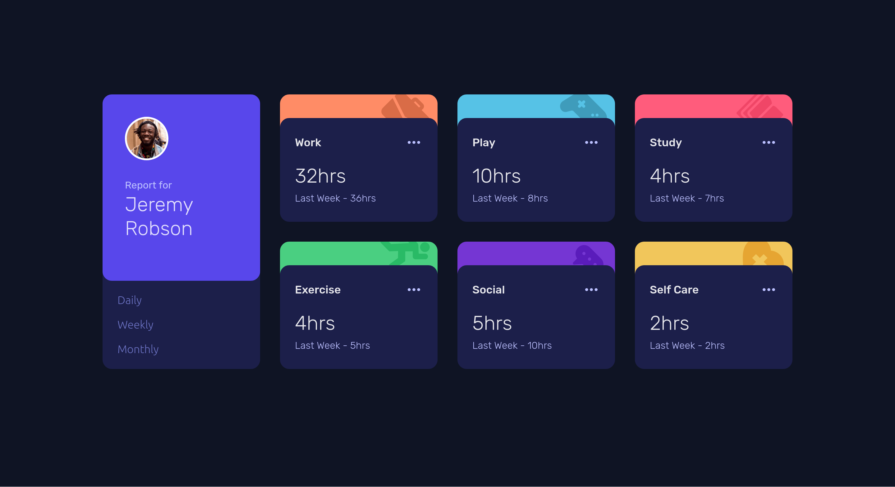

# Frontend Mentor - Time tracking dashboard solution

This is a solution to the [Time tracking dashboard challenge on Frontend Mentor](https://www.frontendmentor.io/challenges/time-tracking-dashboard-UIQ7167Jw). Frontend Mentor challenges help you improve your coding skills by building realistic projects.

## Table of contents

- [Overview](#overview)
  - [The challenge](#the-challenge)
  - [Screenshot](#screenshot)
  - [Links](#links)
- [My process](#my-process)
  - [Built with](#built-with)
  - [What I learned](#what-i-learned)
  - [Continued development](#continued-development)
  - [Useful resources](#useful-resources)

**Note: Delete this note and update the table of contents based on what sections you keep.**

## Overview

### The challenge

Users should be able to:

- View the optimal layout for the site depending on their device's screen size
- See hover states for all interactive elements on the page
- Switch between viewing Daily, Weekly, and Monthly stats

### Screenshot

### Links

- Solution URL: [Time Tracking Dashboard](https://www.frontendmentor.io/solutions/responsive-time-tracking-dashboard-using-htmlsass-and-js-with-vite-NuiLD0elcv)
- Live Site URL: [Time Tracking Dashboard](https://fem-time-tracking-dashboard-nu.vercel.app/)

## My process

### Built with

- Semantic HTML5 markup
- CSS custom properties
- Flexbox
- CSS Grid
- Mobile-first workflow
- [vite](https://vite.dev/guide/) - build tool

### What I learned

- Learned to use fetch API and how is it working.
- Learned DOM manipulation using the data fetched.
- Learned how to use the data coming from an external file efficienlty.
- Learned how to select elements to be used for DOM manipulation effectively.

### Continued development

- Want to use a real world dashboard API and render them like this dashboard.
- Want to learn to work with complex JSON data and fetch it effectively.

### Useful resources

- [MDN](https://developer.mozilla.org/en-US/docs/Learn_web_development/Core/Scripting/Network_requests#the_fetch_api) - Fetch API Introduction by mdn.
- [CSS tricks](https://css-tricks.com/snippets/css/complete-guide-grid/) - Grid layout go-to guide
